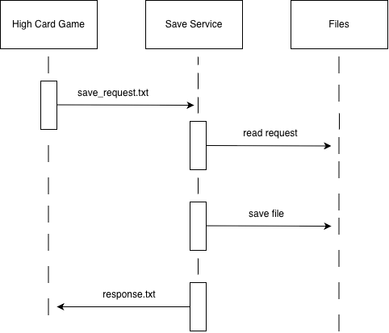

 Save Microservice

## Description

The Save Microservice allows a program to save data into files. The requesting program sends a save request through a text file. The Save Service reads the request, saves the data, and returns a response showing whether the save was successful.

Communication pipe: Text files

# Communication Contract

## Requesting Data

To request the Save Microservice, the requesting program must create a text file named:

save_request.txt

The file must contain two parameters:

file_name:
- The name of the file where the data will be saved.

save_data:
- The information that should be stored.

Example request file:

file_name=HighCardStats.txt
save_data=Wins:55,Losses:45

The Save Service reads this file and saves the provided data into the requested file.

Example call (C++):

ofstream request("save_request.txt");

request << "file_name=HighCardStats.txt\n";
request << "save_data=Wins:55,Losses:45\n";

request.close();

## Receiving Data

After processing the save request, the Save Service creates a response file named:

save_response.txt

The requesting program reads this file to determine whether the save was successful.

Example response:

status=success
file_saved=HighCardStats.txt

Example call (C++):

ifstream response("save_response.txt");

string line;

while(getline(response, line)){
    cout << line << endl;
}

response.close();

## UML Sequence Diagram

